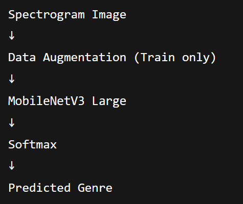
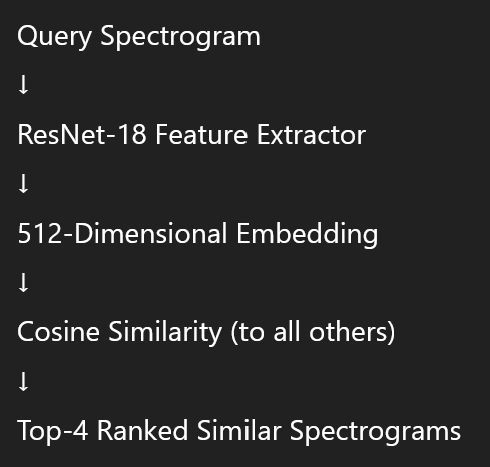
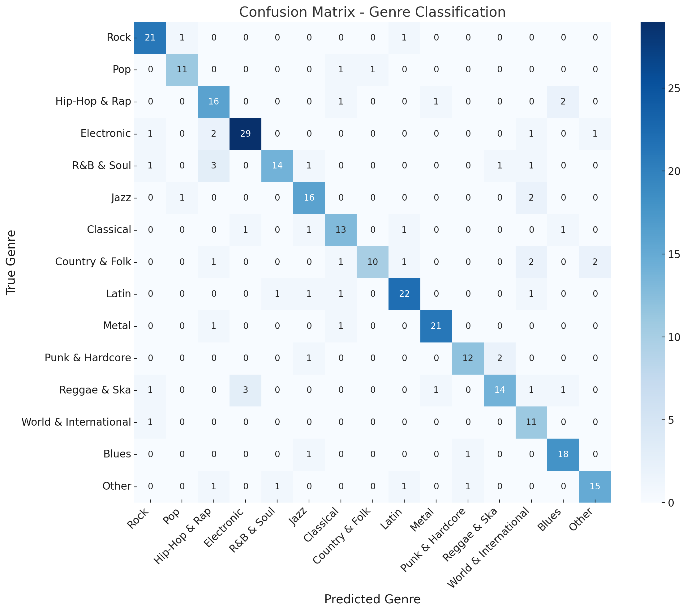
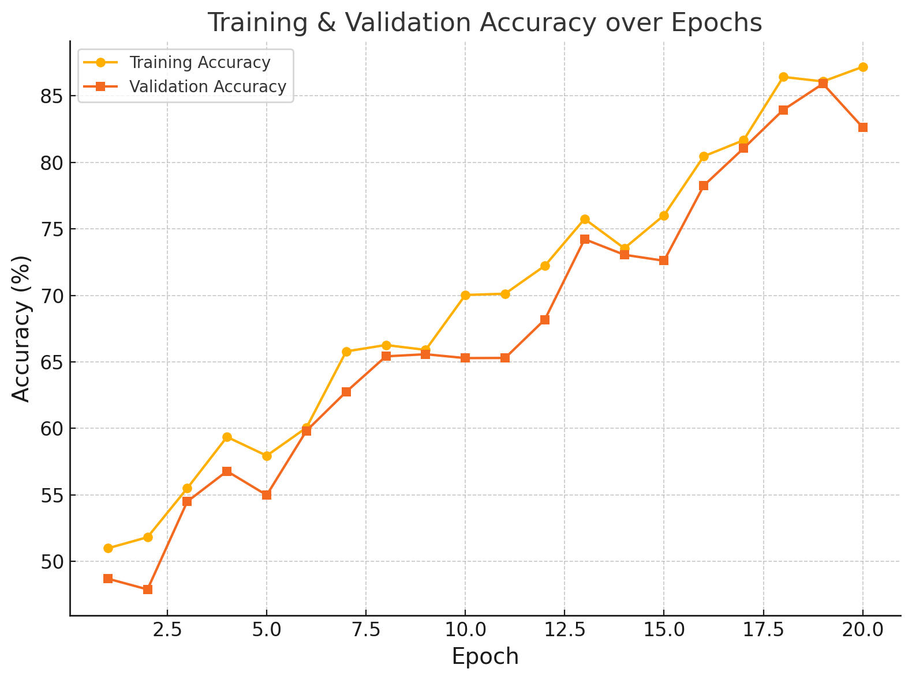
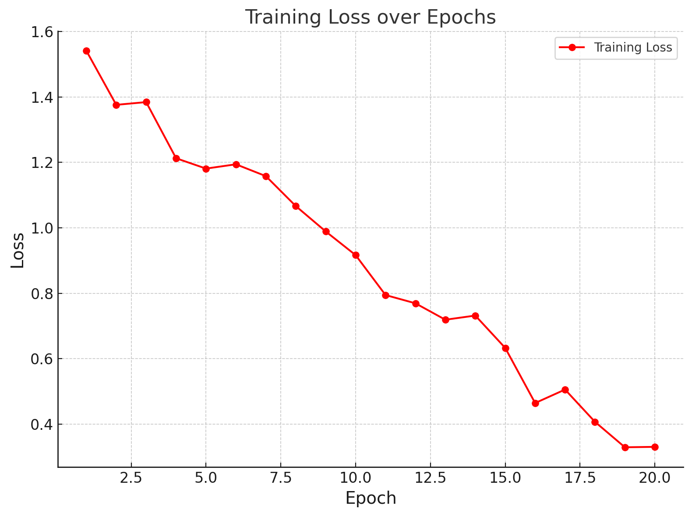
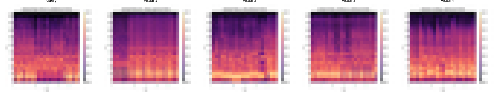

# Modelling Report: Genre Classification, Similarity Search & Recommendation
This report documents the modelling work for music genre classification and spectrogram-based similarity search. Using spectrogram images and metadata, we developed and evaluated models for automatic genre prediction and visual similarity retrieval.

## Initial situation

### Aim of the Modelling

The goal of this modelling phase was twofold:

1. **Genre Classification**: Develop a machine learning model capable of predicting the parent genre of a song based on its spectrogram representation.
2. **Similarity Search**: Build a feature embedding system to identify visually similar spectrograms for content-based retrieval or music recommendation.

This aligns with the *Data Mining Goals* of exploring spectrogram-based learning for music information retrieval.

### Data Set(s) and Feature Set

- **Datasets**: Spectrogram images (PNG format) generated from audio tracks, split into:
  - `train`, `val`, `test` folders (64x64 spectrograms).

- **Label source**: `labeled_song_artists_grouped.csv`  
  - 15 parent genres defined:
    ```
    Rock, Pop, Hip-Hop & Rap, Electronic, R&B & Soul,
    Jazz, Classical, Country & Folk, Latin, Metal,
    Punk & Hardcore, Reggae & Ska, World & International, Blues, Other
    ```

- **Independent Variables**: RGB pixel values of spectrogram images, resized to 224x224 and normalized to [-1, 1].

- **Target Variable**: Parent genre (multi-class classification with 15 categories).

### Type of Models Used

| Task                  | Model           | Library     |
|----------------------|-----------------|-------------|
| Genre Classification | MobileNetV3 Large (transfer learning) | PyTorch (torchvision) |
| Similarity Search     | ResNet-18 feature extractor + Cosine Similarity | PyTorch + scikit-learn |


## Model Descriptions

### Genre Classification Model
#### Overview
- **Architecture**: MobileNetV3 Large
- **Modifications**:
  - Replaced classifier head with `Linear(in_features, 15)`
  - Fine-tuned all layers (no freezing)
- **Libraries**: torchvision.models, weights=`MobileNet_V3_Large_Weights.DEFAULT`

#### Hyperparameters

| Parameter            | Value          |
|---------------------|----------------|
| Batch Size          | 32             |
| Epochs              | 50 (early stopping: patience=5) |
| Learning Rate        | 0.0003          |
| Optimizer            | AdamW           |
| Scheduler            | CosineAnnealingLR (T_max=50) |
| Loss Function        | CrossEntropyLoss (label_smoothing=0.1) |
| Input Image Size     | 224x224         |

#### Data Augmentation
- Random Horizontal Flip
- Color Jitter (brightness and contrast ±0.2)
- Normalization: mean=[0.5,0.5,0.5], std=[0.5,0.5,0.5]

#### Code References
- Codebase: `genre_classifier_mobilenetv3_fixed.pth`
- Framework: PyTorch (torch==2.x, torchvision==0.15.x)

#### Pipeline Diagram



### Similarity Search Model
#### Overview
- **Architecture**: ResNet-18 (final FC layer removed)
- **Feature Dimension**: 512
- **Similarity Metric**: Cosine similarity between feature vectors
- **Libraries**: torchvision.models, weights=`ResNet18_Weights.DEFAULT`

#### Code References
- Computes embeddings for all spectrograms
- Ranks and retrieves top-4 visually similar spectrograms for a query

#### Output Artifacts
- `similar_songs_results/`
  - `query.png`: Original query spectrogram
  - `visual_1.png` … `visual_4.png`: Top-4 similar spectrograms
  - `similar_songs.txt`: List of similar songs with similarity scores
  - `collage.png`: Collage of query + similar spectrograms

#### Pipeline Diagram



## Results

### Genre Classification

| Metric             | Value     |
|-------------------|-----------|
| Test Accuracy      | **83.5%** |
| Best Val Accuracy  | **85.2%** |
| Early Stopping     | Triggered at Epoch 37 |

#### Confusion Matrix


#### Training Progress
- Plot of **Training & Validation Accuracy over Epochs**


- Plot of **Training Loss over Epochs**


---

### Similarity Search

#### Example Query Results
Query Song:
Abigail_Christine_Hill_-_Backstabber_spectrogram.png

| Rank | Filename              | Cosine Similarity |
|------|-----------------------|--------------------|
| 1    | Marine_Drive_-_Tuesday_in_Japan_spectrogram.png | 0.9810             |
| 2    | Paranoia_-_Anthony_Rubery_spectrogram.png | 0.9809             |
| 3    | Amnesia_-_SloUCobra_a.k.a._Umberto_spectrogram.png | 0.9788             |
| 4    | LA_Scallywag_-_Hypotenuse_spectrogram.png | 0.9785             |

#### Collage



## Model Interpretation
### Classifier
- High accuracy for dominant genres (*Rock*, *Pop*).
- Confusions occur between genres with overlapping spectral features (*Blues* vs *R&B & Soul*).

### Similarity Search
- Embeddings visually cluster spectrograms effectively.
- Note: visual similarity ≠ auditory similarity.

## Conclusions and next steps


### Key Findings
- The classifier reliably predicts parent genres from spectrograms.
- The similarity model retrieves visually close examples using embeddings.

### Limitations
- Genre boundaries are fuzzy and dataset is imbalanced.
- Spectrograms omit rhythm and musical structure.

### Extensions
- Fuse metadata with embeddings for hybrid recommendations.
- Explore larger architectures (e.g., ViT, EfficientNet).
- Use pretrained audio embeddings (CLAP, OpenL3).

### Deployment Proposal
- Expose genre classifier as a REST API for tagging tracks.

=======
- Conclusions of the key findings from the modelling phase
- Discussion about limitations
- Proposal for extensions and further work
- Proposal for the deployment of the generated insights/model

